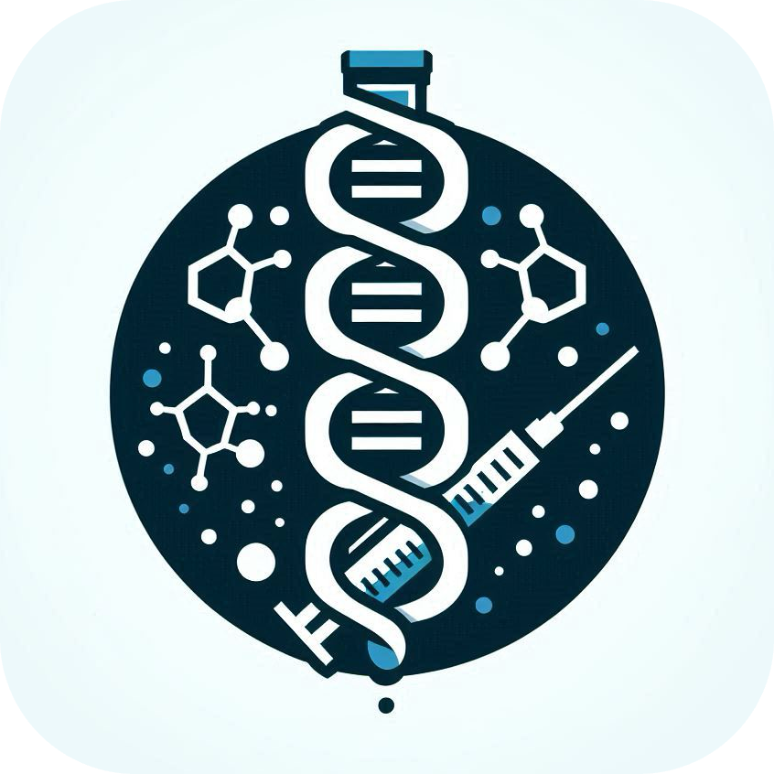

  
  <h1 style="text-align: center;">Vaccine Tracker</h1>

Manage information on vaccination using CSV data files.

# Program functionality

The program consists of two parts:

- Main: The main program uses a command-line interface program, providing a menu and options.
- Generator: It uses CSV files to store the data, and the Snowflake algorithm to generate IDs.

# Build

1. Clone the repository using Git.
2. Make sure you have a c/c++ environment and use cmake to build the project.
3. The project is developed using CLion, and it is recommended to open it directly in CLion.
4. The CSV data is generated by the generator and is not included in the git repository, please be sure to generate the data before running the program. 